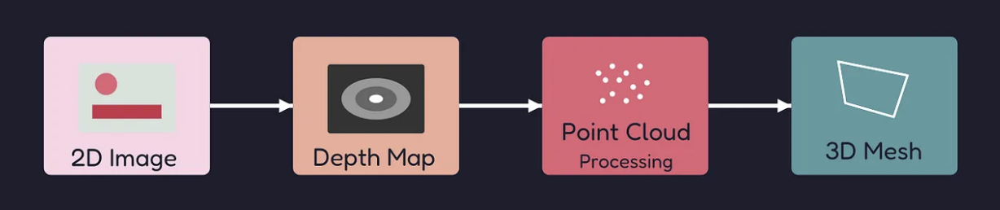

# Tower Reconstruction from 2D Images

This project focuses on implementing a robust pipeline for detecting triangular antenna configurations from 2D images to generate corresponding dynamic 3D blender models based on the detection results and other input configurations

## Project Overview

The system consists of three main components:
1. **Object Detection**: YOLO-based detection of triangular antennas to corresponding sides (classes A, B, C)
2. **Configuration Generation**: Automatic creation of tower configuration files based on detection results
3. **3D Tower Generation**: Procedural generation of triangular tower 3D models in GLB format

## Directory Structure

```
problem_v1/
├── build_tower.py              # Main 3D tower generation script
├── generate_config.py          # Configuration file generator
├── yolo11n.pt                  # YOLO model weights (nano version)
├── yolov8m.pt                  # YOLO model weights (medium version)
├── tower.glb                   # Generated 3D tower model
├── data/                       # Training and validation dataset
│   ├── data.yaml              # YOLO dataset configuration
│   ├── images/
│   │   ├── train/             # Training images (160 triangle images)
│   │   └── val/               # Validation images (40 triangle images)
│   └── labels/
│       ├── train/             # Training labels in YOLO format
│       └── val/               # Validation labels in YOLO format
├── runs/                      # YOLO training and inference results
│   └── detect/
│       ├── train/             # Training metrics and visualizations
│       └── predict/           # Prediction results on validation set
├── tower_configs/             # Generated tower configuration JSON files
├── real_tower_data/           # Additional (Experimental Methodology)
│   ├── 0.png                  # Sample tower image
│   ├── 0_depth.png           # Depth map
│   ├── depth_recon.ipynb     # Depth reconstruction notebook
│   └── mesh_ortho.obj        # Reconstructed 3D mesh
└── README.md                  # Readme file
```

## Dataset Information

- **Total Images**: 200 triangle images
- **Training Set**: 160 images (triangle_001.jpg to triangle_160.jpg)
- **Validation Set**: 40 images (triangle_161.jpg to triangle_200.jpg)
- **Classes**: 3 antenna types / positioned sides (A, B, C)
- **Label Format**: YOLO format with bounding boxes

### Label Format
Each `.txt` file contains bounding box annotations in YOLO format:
```
class_id center_x center_y width height
```
Where:
- `class_id`: 0 (A), 1 (B), or 2 (C)
- All coordinates are normalized (0-1)

## Core Components

### 1. Object Detection (`data/`)

The project uses YOLO for detecting triangular antennas with three classes:
- **Class 0 (A)**: Type A antennas
- **Class 1 (B)**: Type B antennas  
- **Class 2 (C)**: Type C antennas

Model weights provided:
- `yolo11n.pt`: YOLO11 nano model
- `yolov8m.pt`: YOLOv8 medium model

Output Locations:
- Annotated images → runs/detect/predict/
- YOLO labels → runs/detect/predict/labels/

### 2. Configuration Generation (`generate_config.py`)

Automatically generates tower configuration files based on YOLO detection results:

```python
python generate_config.py
```

**Features:**
- Reads YOLO prediction labels from `runs/detect/predict/labels/`
- Counts detected antennas by type (A, B, C)
- Generates JSON configuration files with tower parameters
- Default tower specifications:
  - Pole height: 20 units
  - Pole radius: 0.1 unit
  - Antenna height: 0.2 units
  - Antenna distance from pole: 1.4 units

### 3. 3D Tower Generation (`build_tower.py`)

Procedurally generates 3D triangular tower models using the Trimesh library:

```python
python build_tower.py <path to config file> <path to output file>
```

**Features:**
- **Triangular Architecture**: Three-sided tower structure
- **Dual Ring System**: Two top rings with configurable gap
- **Multi-level Support**: Configurable number of structural levels
- **Antenna Placement**: Half-cylinder antennas positioned on triangle edges
- **GLB Export**: Industry-standard 3D format output

**Tower Components:**
- Central cylindrical pole
- Two triangular rings at the top (Ring 0 and Ring 1)
- Vertical connecting tubes between rings
- Lower tubular levels with inner/outer triangular frames
- Half-cylinder antennas mounted on triangle edges

**Configurable Parameters:**
```json
{
  "pole_height": 20,
  "pole_radius": 0.1,
  "antenna_height": 0.2,
  "antenna_distance_from_pole": 1.5,
  "antennas": {
    "A": 4,
    "B": 1,
    "C": 4
  }
}
```

## Installation Requirements

```bash
pip install numpy trimesh pathlib
pip install ultralytics  # For YOLO
pip install opencv-python matplotlib  # For image processing
pip install open3d  # For 3D processing (depth reconstruction)
pip install torch transformers  # For depth estimation models
```

## Usage Workflow

### 1. Train/Run YOLO Detection

# Training
```bash
Note!
Edit the data.yaml file with abs path to data folder before training
```
```bash
yolo task=detect \
  mode=train \
  model=yolov8m.pt \
  data=abs path to data.yaml \
  epochs=50 \
  imgsz=640 \
  batch=16
```

# Inference on validation set
```bash
yolo task=detect \
  mode=predict \
  model=runs/detect/train/weights/best.pt \
  source=abs path to val data \
  save=True \
  save_txt=True
```

### 2. Generate Tower Configurations
```python
python generate_config.py
```
This creates configuration files in `tower_configs/` directory.

### 3. Generate 3D Tower Models

# Generate single tower
```python
python build_tower.py <path to json config file> <path to output glb file>
```

## Additional (Experimental: Point Cloud Based Methodology)

### Depth Reconstruction (`real_tower_data/depth_recon.ipynb`)



The is an additional experimental exploration of the same problem using monocular depth estimation and poisson surface reconstruction techniques to 
generate a point cloud from the input 2D real world image, which is further subjected to mesh reconstruction to be exported in various 3D formats :
- Monocular Depth estimation using pre-trained model (DepthAnythingV2)
- Point cloud generation from depth maps
- 3D mesh reconstruction using Poisson surface reconstruction
- Export to various 3D formats (.obj, .xyz)


